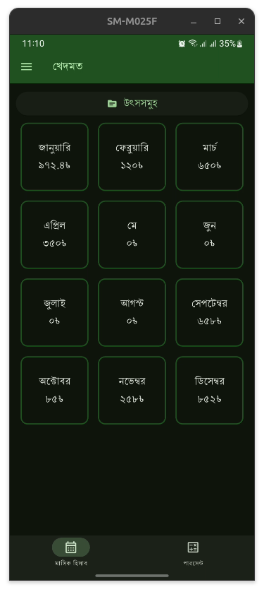
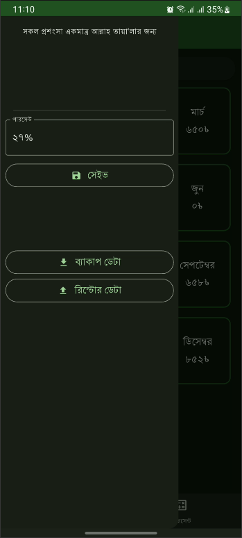
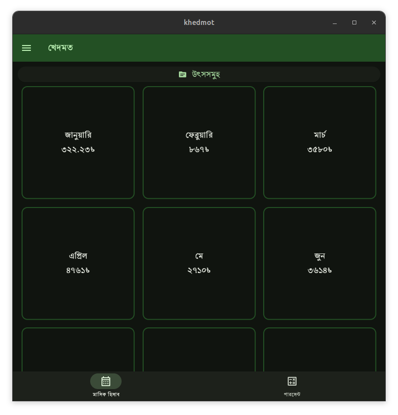
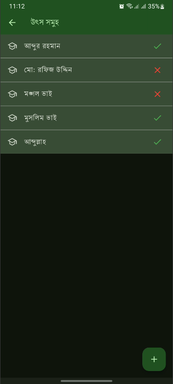
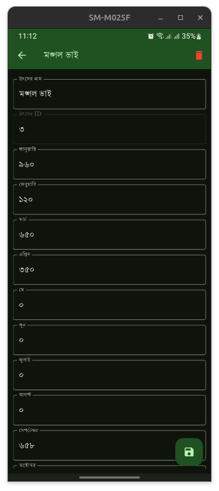
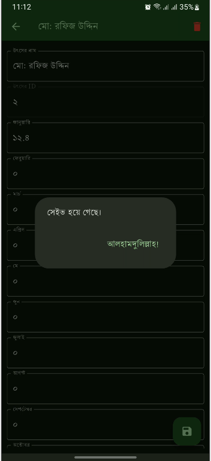
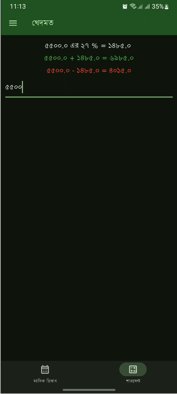

# Khedmot

This is a flutter based app that helps to take note on earning sources and to calculate percentage .

## Features
- Note different incomes in months for a year
- See overview of incomes
- Persent calculator
- Materialized Design
- Backup and Restore
- Multiplatform(flutter)

## Download
Android: [APK](https://github.com/rafiz001/khedmot/releases/download/v1.0.1%2B2/app-release_1.0.1.apk)

Ubunutu: [ZIP](https://github.com/rafiz001/khedmot/releases/download/v1.0.1%2B2/kedmot_x64_linux_1.0.1.zip)
## Screenshots

Months View: \
 

App Drawer: \

Desktop App: \

Income Sources: \

Form: \

Dialog: \

Persent Calculator: \

